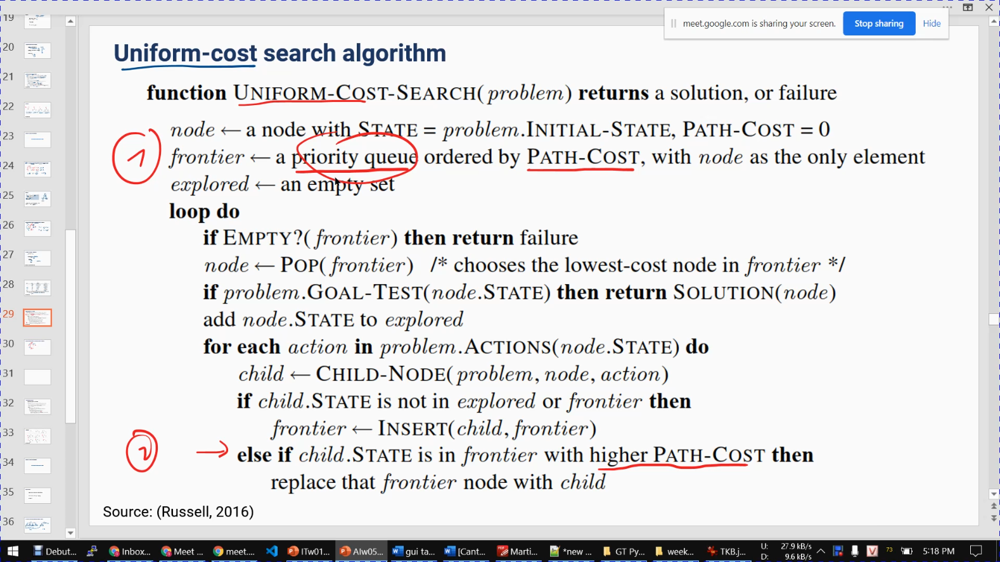
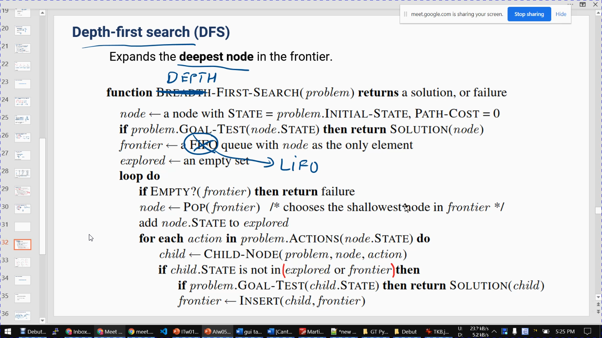
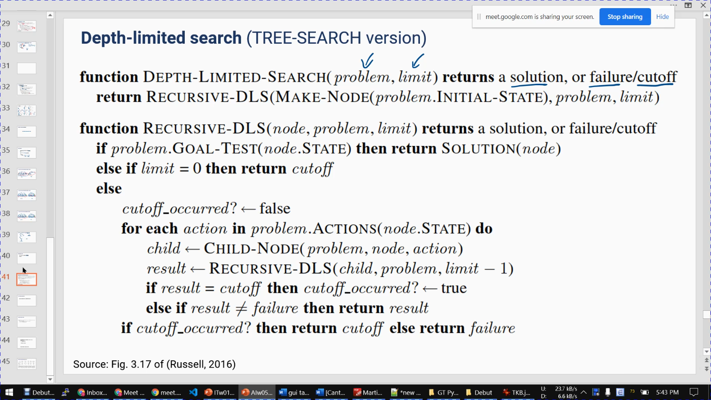
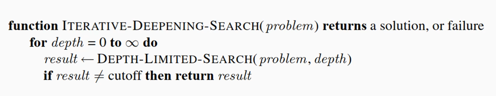
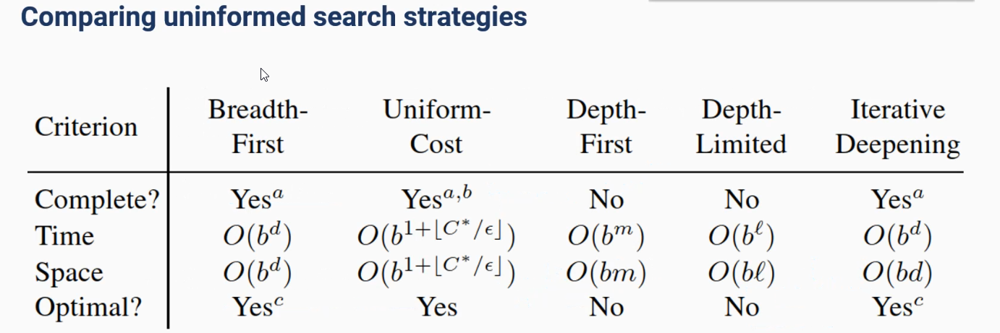
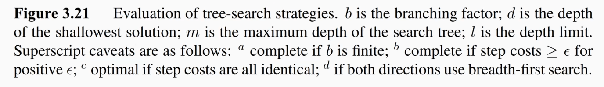

# Thuật toán AI cổ điển


## 1. Basic concept


### 4 cách tiếp cận (trường phái) của AI của AI:
Thinking humanly

> - AI suy nghĩ như con người
> - ANN (neron)
> - Watching thought

Thinking rationally: 
    
> Không cần suy nghĩ như con người, chỉ cần suy nghĩ theo hướng logic toán học 

Action humanly: 

> - Không quan tâm thuật toán bên dưới, chỉ cần hành động diễn ra đúng là được
> - Thí nghiệm: Turing dest
> - Nhiều hạn chế, dễ bị qua mặt, giả AI (sử dụng mẹo)


Action rationally: 

> Tìm **solution** bằng 1 chuỗi các **action**

### Cơ sở của AI

- Triết học
- Toán
- Neuron science
- Tâm lý học
- Ngôn ngữ học
- Kỹ thuật máy tính
- Lý thuyết điều khiển


### Basic Concept

AI (agent) tác động 1 action nào đó vào môi trường (enviroment) làm enviroment thay đổi trạng thái từ s => s' và ngược lại môi trường cung cấp các percepts (observation) để agent biết được thông tin về môi trường

Sau vài action thì agent sẽ có reward để nó hướng tới kết quả

> và Agent sẽ cố gắng có reward cao nhất

==> Thiết kế hệ thống chấm điểm hợp lý cho Agent

Nên đưa chỉ dẫn chi tiết gợi ý chi tiết cho Agent, tuy nhiên phải đủ chứ không nên thiên về 1 hướng; 

> Chi tiết thì tốt nhưng phải đầy đủ
> Tập trung hướng tới mục đích cuối cùng

### *Cách đánh giá 1 thuật toán*

**Completeness:** luôn tìm ra solution nếu như solution tồn tại

**Optimality:** 

- thuật toán luôn trả ra kết quả optimal;
- 1 thuật toán phải comleteness mới optimal 

**Complexity:** độ phức tạp


## 2. Uninformed search

### 2 bước chính của 1 thuật toán

- Chọn 1 Node (Search Stratery)
- Mở rộng ra các Node
- Lặp cho tới khi kết thúc

### Tree search

- Frontier: tập các node mà chưa đi đến/có thể mở rộng
- Vấn đề: vòng lặp vô tận

### Graph search

- Tương tự Tree search
- Thêm mảng explored: chứa các Node đã đi qua

### 2 loại thuật toán tìm kiếm

- Tìm kiếm mù: Uninformed search (không có thông tin trước); Chọn các node 1 cách ngẫu nhiên
- Tìm kiếm có thông tin:  Informed search
  - Nhanh hơn
  - Nhưng phải cung cấp dữ liệu

### ***Breadth first search***


- Chọn 1 node gốc, mở rộng nó ra đầu tiên
- Mở rộng tất các các node con của node gốc 
- Tiếp tục mở rộng các node con của nó

#### 1 thành phần của node:

- state: trạng thái hiện tại
- parent: node cha của node này
- action: hành động dẫn đến node này  ==>  để truy solution
- path-cost: từ initial state đến đây
- Hàm **Child Node**(problem, parent, action): ==> node 

#### Đánh giá

BFS có thể đưa ra solution tốt nhất nếu path cost là 1 hàm không giảm theo chiều sâu (càng sâu thì path cost càng lớn)

Optimal có điều kiện

Tốn kém về thời gian và bộ nhớ

#### Code python:

```python
def breadth_first_graph_search(problem):
    """Bread first search (GRAPH SEARCH version)
    See [Figure 3.11] for the algorithm"""

    node = Node(problem.initial)
    if problem.goal_test(node.state):
        return node
    frontier = deque([node])
    explored = set()
    while frontier:
        node = frontier.popleft()
        explored.add(node.state)
        for child in node.expand(problem):
            if child.state not in explored and child not in frontier:
                if problem.goal_test(child.state):
                    return child
                frontier.append(child)
    return None
```


### ***Uniform-cost search***




Giống như BFS, khác ở chỗ đổi queue thành priority queue

Nếu như state đó tồn tại trong Frontier rồi mà có cost lớn hơn thì thế bằng node hiện tại

#### Đánh giá

Optimal cho mọi trường hợp

Chưa giải quyết được sự phức tạp của BFS

### ***Depth first search***



- Mở rộng ở node sâu nhất trong frontier
- Thay FIFO queue ở BFS thành LIFO queue (stack)

#### Đánh giá:

- Kết quả không optimal
- Tốn ít bộ nhớ hơn BFS 
- Không có tính complete: có trường hợp không tìm được solution nhưng đi vào nhánh vô hạn (infinite non-goal path)

> Hướng giải quyết: độ sâu giới hạn

### ***Depth limited search***



Cài đặt bằng đệ quy sẽ đơn giản và ngắn gọn hơn

#### Vấn đề:

- Đặt chiều sâu quá cạn: gặp cutoff trước khi gặp solution
- Đặt chiều sâu quá lớn: kết quả trả về không optimal

Giải pháp:

> Cho chiều sâu tăng dần

### ***Iterative deepening search***



Tăng dần chiều sâu

#### Đánh giá:

- Kết quả optimal
- Tiết kiệm bộ nhớ
- Ưu tiên được lựa chọn trong các bài toán tìm kiếm mù

### ***So sánh các thuật toán***





